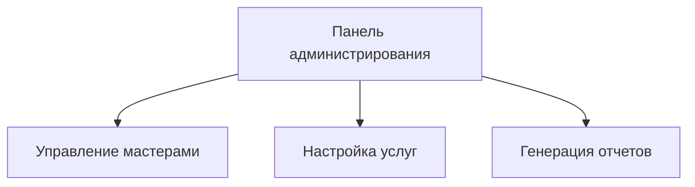

# Документация проекта BeautySalon Booking System

  
*Версия 1.0.0 | Последнее обновление: 15.10.2023*

---

## Оглавление
1. [Описание проекта](#описание-проекта)
2. [Функциональность](#функциональность)
3. [Установка](#установка)
4. [Настройка](#настройка)
5. [Использование](#использование)
6. [API](#api)
7. [Разработка](#разработка)
8. [Лицензия](#лицензия)

---

## Описание проекта
Система онлайн-записи для салонов красоты с функциями:
- Управления расписанием мастеров
- Онлайн-бронирования для клиентов
- Автоматических уведомлений
- Аналитики посещаемости

**Технологии**:
- Backend: Node.js + Express
- Frontend: React
- БД: PostgreSQL
- Деплой: Docker

---

## Функциональность
### Для администраторов


### Для клиентов
- 📅 Онлайн-запись через веб-интерфейс
- 🔔 Напоминания о записи (SMS/Email)
- ⭐ Система отзывов

---

## Установка
### Требования
- Node.js v16+
- PostgreSQL 12+
- Docker (опционально)

### Пошаговая установка
```bash
# Клонирование репозитория
git clone https://github.com/yourusername/beautysalon-booking.git
cd beautysalon-booking

# Установка зависимостей
npm install

# Настройка БД (создайте файл .env)
cp .env.example .env

# Запуск в dev-режиме
npm run dev
```

---

## Настройка
Основные параметры в `.env`:
```ini
DB_HOST=localhost
DB_PORT=5432
DB_USER=beauty_admin
DB_PASS=securepassword
JWT_SECRET=your_jwt_secret
```

---

## Использование
### Команды
| Команда | Описание |
|---------|----------|
| `npm start` | Production-запуск |
| `npm test` | Запуск тестов |
| `npm run migrate` | Применение миграций |

### Примеры
Создание нового мастера через CLI:
```javascript
const { createMaster } = require('./services/masters');
createMaster({
  name: "Анна",
  specialty: "Парикмахер"
});
```

---

## API
### Основные endpoints
| Метод | Endpoint | Описание |
|-------|----------|----------|
| `POST` | `/api/bookings` | Создание записи |
| `GET` | `/api/masters` | Список мастеров |

Пример запроса:
```http
POST /api/bookings HTTP/1.1
Content-Type: application/json

{
  "masterId": 5,
  "serviceId": 12,
  "clientPhone": "+79161234567"
}
```

---

## Разработка
### Структура проекта
```
beautysalon-booking/
├── client/          # Frontend
├── server/          # Backend
│   ├── controllers/
│   ├── models/
├── docs/            # Документация
```
